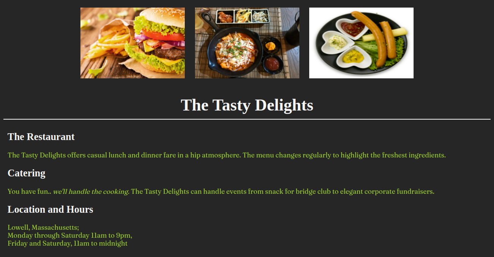

# The Tasty Delights

## Context

Stevan Grace, master chef and author, runs The Tasty Delights Restaurant with his family in Lowell, Massachusetts. He wants to widen his business by increasing their visibility among web customers and hence planned to create a simple website to attract them.

With a clean and simple design, the website should draw all its viewers’ attention to the food. The backgrounds are dark with fonts in pale light shades. This shall make the images of their food the sharpest and brightest colours on the page, naturally making them stand out. 

As the first step, you are required to create a simple web page to highlight the restaurant details in a simple, elegant manner to attract the web customers.

### Problem Statement

Create a replica of a simple web page as shared in the image below.

### Tasks

- This practice is an extension to Sprint 1 – Practice 2 – The Tasty Delights.​
- The web page created for The Tasty Delights need to be styled.​
- The solution for this practice can be developed in 4 stages:​​​
    - Stage 1 :: Define styles in styles.css file located in css folder of the boilerplate​​​
    - Stage 2 :: Link the styles.css file with index.html​​ using <link> tag​
    - Stage 3 :: Link the google font stylesheet with index.html using <link> tag​
      <link href="https://fonts.googleapis.com/css2?family=Fraunces" rel="stylesheet">​
    - Stage 4 :: Apply styles defined using class or id selector to the page elements

