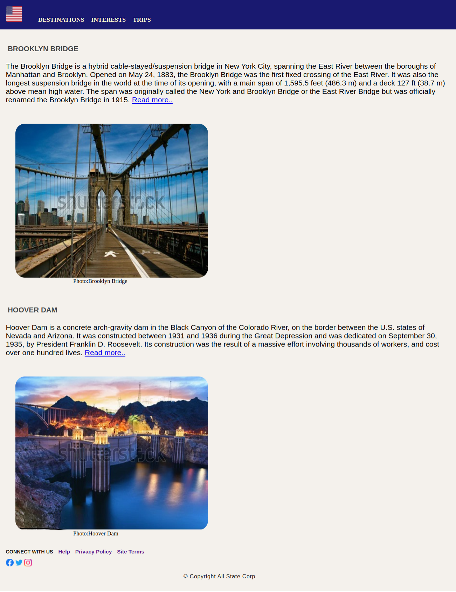

# The Wonders Of America

Our world is filled with the most unique structures that are both man-made and natural. Some of the man-made creations include churches, tombs, temples, monuments, mosques, buildings and even cities. These structures have withstood the test of time and they continue to leave many awestruck with their brilliance. There are many in the world, but only few are selected, which are deemed to be the best.

## Problem Statement

Being a developer you are assigned with the task of styling the web page created in the previous practice that resembles the below image.

### Tasks

- This practice is an extension to Sprint 1 – Practice 2 – Wonders of The United States of America.​
- The web page created for the practice of sprint 2 needs to be styled.​
- The solution for this practice can be developed in 4 stages:​​​
    - Stage 1 :: Define styles in styles.css file located in css folder of the boilerplate​​​
    - Stage 2 :: Link the styles.css file with index.html​​ using <link> tag​
    - Stage 3 :: Apply styles defined using class or id selector to the page elements
- In stage 1, following tasks can be performed to define styles for the web page​
- Task 1 :: Styling header with navbar​
- Task 2 :: Styling content sections​
- Task 3 :: Styling footer​

